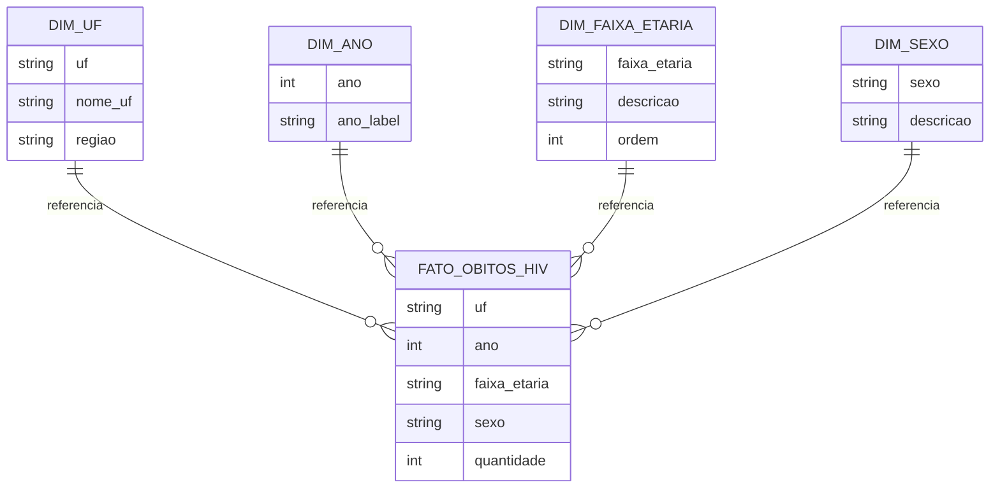

# Modelagem dos Dados

## 1. Introdução

Este documento apresenta a modelagem adotada no MVP de Engenharia de Dados baseado em informações exportadas do DATASUS TABNET, cobrindo morbidade hospitalar e óbitos por HIV entre 2020 e 2025. A modelagem foi estruturada conforme boas práticas de arquitetura moderna (medallion architecture), com foco em padronização, rastreabilidade e preparação dos dados para análises na camada Gold.

---

## 2. Arquitetura Adotada (Medallion Architecture)

### **Bronze – Dados Brutos**

* Ingestão direta dos arquivos CSV exportados do TABNET.
* Armazenamento em formato Delta para garantir versionamento e confiabilidade.
* Sem transformações além da leitura inicial.

### **Silver – Dados Tratados e Padronizados**

* Padronização dos schemas.
* Conversão de tipos.
* Tratamento de valores nulos e inconsistentes.
* Uniformização de colunas: `uf`, `ano`, `faixa_etaria`, `sexo`, `quantidade`.
* Geração de tabelas normalizadas prontas para agregações.

### **Gold – Dados Modelados para Consumo Analítico**

* Aplicação de agregações e cálculos por estado, ano e faixa etária.
* Tabelas modeladas para responder às perguntas de negócio definidas na sprint.

---

## 3. Modelagem Conceitual

A modelagem segue uma abordagem simples em estrela (**Star Schema**) apropriada para análises descritivas.

### **Fato Principal**

**Fato_Obitos_HIV**

* Contém registros de óbitos decorrentes de internações no SUS por HIV.
* Granularidade: *UF + Ano + Faixa Etária + Sexo*.

### **Dimensões**

* **Dim_UF** — lista de Unidades da Federação com nome e sigla.
* **Dim_Ano** — intervalo 2020–2025.
* **Dim_FaixaEtaria** — faixas padronizadas utilizadas no MVP.
* **Dim_Sexo** — Masculino, Feminino ou Total.

---

## 4. Modelagem Lógica

### **Tabela: fato_obitos_hiv**

| Coluna       | Tipo   | Descrição                     |
| ------------ | ------ | ----------------------------- |
| uf           | STRING | Sigla da Unidade da Federação |
| ano          | INT    | Ano do registro               |
| faixa_etaria | STRING | Faixa etária padronizada      |
| sexo         | STRING | Sexo (masc, fem ou total)     |
| quantidade   | INT    | Quantidade de óbitos          |

### **Tabela: dim_uf**

| Coluna  | Tipo   |
| ------- | ------ |
| uf      | STRING |
| nome_uf | STRING |
| regiao  | STRING |

### **Tabela: dim_faixa_etaria**

| Coluna       | Tipo   |
| ------------ | ------ |
| faixa_etaria | STRING |
| descricao    | STRING |
| ordem        | INT    |

### **Tabela: dim_sexo**

| Coluna    | Tipo   |
| --------- | ------ |
| sexo      | STRING |
| descricao | STRING |

### **Tabela: dim_ano**

| Coluna    | Tipo   |
| --------- | ------ |
| ano       | INT    |
| ano_label | STRING |

---

## 5. Regras de Transformação da Silver para Gold

* Remoção de valores nulos.
* Conversão de "-" para 0.
* Normalização dos nomes das colunas em todas as tabelas.
* Agregações por UF, ano, sexo e faixa etária.
* Geração de tabelas resumidas:

  * **obitos_por_uf**
  * **obitos_por_ano**
  * **obitos_por_faixa_etaria**
  * **obitos_por_sexo**

---

## 6. Diagrama Simplificado (Mermaid)

---

## 7. Considerações Finais

A modelagem proposta segue princípios de simplicidade, rastreabilidade e aderência ao escopo do MVP. Foi construída para suportar consultas analíticas diretas, dashboards e exportações para análises adicionais. Está alinhada às boas práticas da arquitetura em camadas (Bronze → Silver → Gold) e permite fácil expansão futura.

Caso deseje, posso gerar também a **versão final do README**, **dicionário de dados**, **qualidade dos dados** e **estrutura final para GitHub**.
