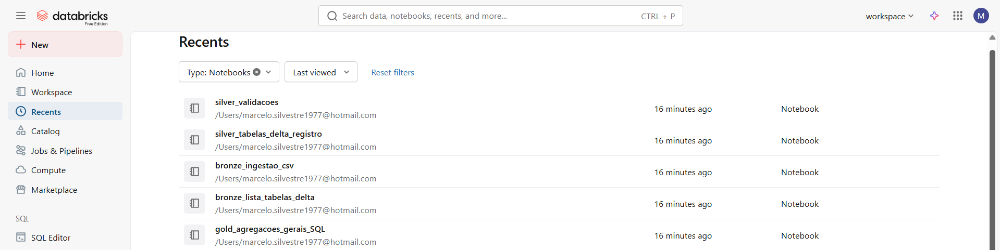

# Evidências de Desenvolvimento do MVP no Databricks

Este documento apresenta **registros visuais (prints de tela)** que evidenciam a **criação, desenvolvimento e execução** do MVP **diretamente na plataforma Databricks**.

Os prints demonstram o uso efetivo do ambiente Databricks Free Edition, seus recursos nativos. A execução real dos processos de ingestão, transformação e análise de dados constam na pasta notebooks.

---

## Evidências Visuais do Databricks

Abaixo estão listados os prints de tela que comprovam o desenvolvimento do MVP na plataforma Databricks:

### 1- Evidência da criação do projeto mvp_datasus e estrutura em camadas no Databricks Free Edition:
---

### 2- Conteúdo da camada bronze:
---

---
### 3- Conteúdo da camada silver:
---

---
### 4- Lista dos notebooks:
---

---
**Observação:**  
As imagens apresentadas correspondem a capturas de tela reais do ambiente Databricks utilizado durante o desenvolvimento do MVP. A versão disponibilizada neste repositório reflete a exportação fiel dos notebooks e resultados gerados na plataforma.

